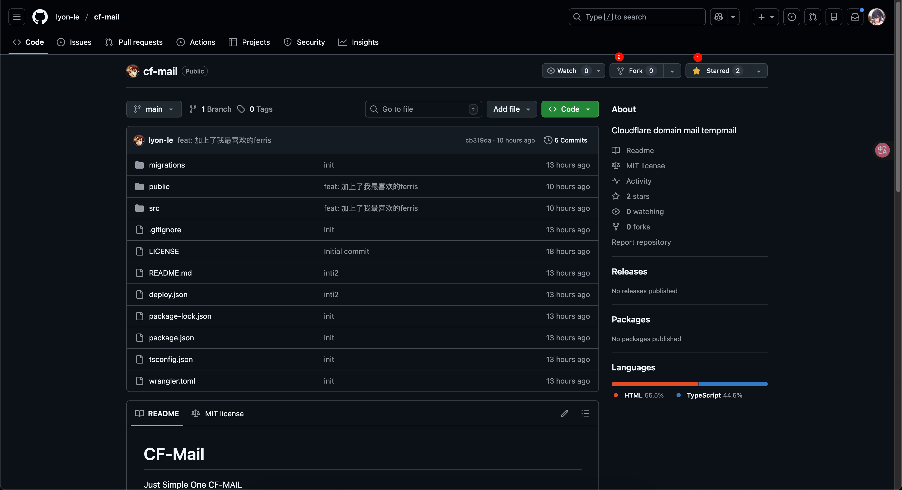

# CF-Mail

Just Simple One CF-Mail.

## 特性

- **单用户设计** - 专为个人使用，无需复杂的多用户管理
- **仅收件** - 不支持发件，简单纯粹
- **验证码提取** - 自动识别邮件中的验证码，一键复制
- **Telegram 推送** - 新邮件实时推送到 TG，验证码直接显示，自动获取ChatID
- **自动创建邮箱** - 在主页设置中打开开关后，无需进入到邮箱页面可收码，自动创建的邮箱可以批量删除

## 展示

## 部署

### 方式一：一键部署

点击按钮自动创建仓库并部署到 Cloudflare Workers：

### 不要修改任何值，直接进行部署即可。

### 方式二：Fork 部署

适合想要同步上游更新的用户。

**1. Fork 本仓库**

点击右上角 Fork 按钮，将仓库复制到你的 GitHub 账号下。

**2. 创建 Cloudflare Workers 项目**

1. 进入 [Cloudflare Dashboard](https://dash.cloudflare.com/)
2. 左侧菜单选择 **Workers & Pages**
3. 点击 **Create** → **Pages** → **Connect to Git**
4. 选择你 Fork 的 `cf-mail` 仓库

**3. 配置构建设置**

- Framework preset: `None`
- Build command: `npm run build`
- Build output directory: `dist`

## 大白话就是什么都不用管！

**4. 修改环境变量**

> ⚠️ **重要：部署后请立即修改默认值！**

部署后会自动配置默认环境变量，请在 **Settings** → **Variables and Secrets** 中修改：

| 变量名 | 默认值 | 说明 |
|--------|--------|------|
| `ADMIN_PASSWORD` | `Changeyourpasswordbeforeusingcfmail` | 登录密码，**必须修改** |
| `JWT_SECRET` | `changeyourjwttokenbeforeusingcfmail` | JWT 密钥，**必须修改** |
| `MAIL_DOMAIN` | `example.com,example2.com` | 改成你的域名 |

**5. 绑定 D1 数据库和 R2 存储**

1. 创建 D1 数据库：**Workers & Pages** → **D1** → **Create**
2. 创建 R2 存储桶：**R2** → **Create bucket**
3. 在项目的 **Settings** → **Bindings** 中绑定：
   - D1 Database: 变量名 `DB`
   - R2 Bucket: 变量名 `R2`

## 大白话就是根本不用管

**6. 部署**

保存配置后，点击 **Deployments** → **Retry deployment** 重新部署。

## 部署后配置

### 配置 Email Routing

1. 进入 Cloudflare Dashboard → 你的域名 → **Email** → **Email Routing**
2. 启用 Email Routing
3. 添加路由规则：
   - **Catch-all** → **Send to Worker** → 选择 `cf-mail`

> 数据库表会在首次访问时自动创建，无需手动初始化。

### 配置 Telegram 推送（可选）

**1. 创建 Bot**

1. 打开 Telegram，搜索 [@BotFather](https://t.me/BotFather)
2. 发送 `/newbot`，按提示设置名称
3. 获取 `Bot Token`

**2. 获取 Chat ID**

1. **与你的 Bot 对话，发送任意消息**
2. 设置页面中填入你的Token
3. 自动获取ChatID，如果没获取到请手动访问：
  `https://api.telegram.org/bot<Token>/getUpdates`

**3. 配置变量**

在主页设置中打开开关：

配置后，新邮件会自动推送到 Telegram：

## 鸣谢

- [cloud-mail](https://github.com/maillab/cloud-mail) - Telegram 转发参考
- [freemail](https://github.com/idinging/freemail) - 验证码提取逻辑参考, 一键部署逻辑参考

## License

MIT
